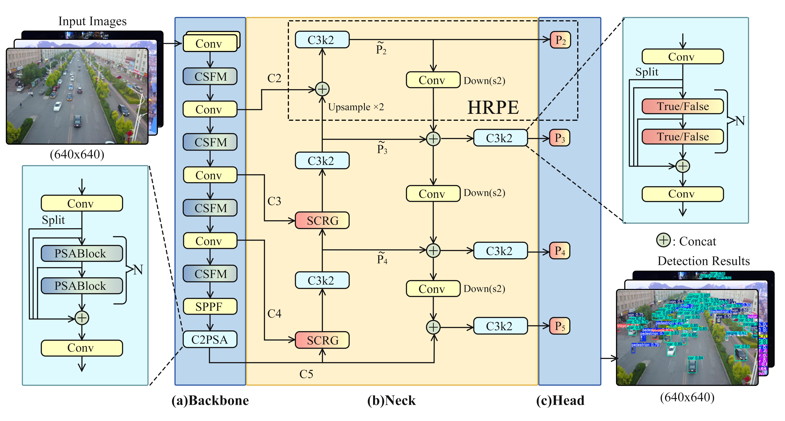

# <div align="center">✨FiLo✨</div>


FiLo is a fidelity-closed-loop tiny-object detector for remote sensing that preserves weak high-frequency cues across feature formation and early fusion to improve localization under dense layouts.

  


# Install
```bash
conda create -n FiLo python=3.10
conda activate FiLo
# If the server supports cuda 12.6, install PyTorch using the following command. Note that the PyTorch version should be greater than or equal to 1.8.
pip install torch torchvision --index-url https://download.pytorch.org/whl/cu126
pip install pyyaml requests psutil einops "numpy==1.26.4"
conda install scipy pandas matplotlib opencv tqdm Pillow h5py libstdcxx-ng=11.2.0 -c conda-forge
```

# Train
## Overview

The model configuration is stored in `ultralytics/cfg/models/new/`. During training, the default configuration file used is `ultralytics/cfg/models/new/FiLo_v0s.yaml`. (The `FiLo_v0s.yaml` refers to calling `FiLo_v0.yaml` with scale `s`, and there are five scale options: `n`, `s`, `m`, `l`, `x`).


## DIOR Dateset
```bash
python train_DIOR.py
```


The DIOR dataset configuration file is `ultralytics/cfg/datasets/DIOR.yaml`. You need to update the `path` field in `ultralytics/cfg/datasets/DIOR.yaml` to the actual dataset directory. The training outputs will be saved in `runs/train/exp_DIOR`.


## RSOD Dateset
```bash
python train_RSOD.py
```

The RSOD dataset configuration file is `ultralytics/cfg/datasets/RSOD.yaml`. You need to update the `path` field in `ultralytics/cfg/datasets/RSOD.yaml` to the actual dataset directory. The training outputs will be saved in `runs/train/exp_RSOD`.


## Visdrone Dateset
```bash
python train_visdrone.py
```


The VisDrone dataset configuration file is `ultralytics/cfg/datasets/VisDrone.yaml`. You need to update the `path` field in `ultralytics/cfg/datasets/VisDrone.yaml` to the actual dataset directory. The training outputs will be saved in `runs/train/exp_visdrone`.


# Validation

## DIOR Dataset

```bash
python val_DIOR.py
```

The DIOR dataset configuration file is `ultralytics/cfg/datasets/DIOR.yaml`. You need to update the `path` field in `ultralytics/cfg/datasets/DIOR.yaml` to the actual dataset directory. Validation uses the trained weights `runs/train/exp_DIOR/weights/best.pt`, and the validation results will be saved to `runs/val/DIOR`.

## RSOD Dataset

```bash
python val_RSOD.py
```

The RSOD dataset configuration file is `ultralytics/cfg/datasets/RSOD.yaml`. You need to update the `path` field in `ultralytics/cfg/datasets/RSOD.yaml` to the actual dataset directory. Validation uses the trained weights `runs/train/exp_RSOD/weights/best.pt`, and the validation results will be saved to `runs/val/RSOD`.

## VisDrone Dataset

```bash
python val_visdrone.py
```

The VisDrone dataset configuration file is `ultralytics/cfg/datasets/VisDrone.yaml`. You need to update the `path` field in `ultralytics/cfg/datasets/VisDrone.yaml` to the actual dataset directory. Validation uses the trained weights `runs/train/exp_visdrone/weights/best.pt`, and the validation results will be saved to `runs/val/Visdrone`.


#  Prediction

## DIOR Dataset

```bash
python predict_DIOR.py
```

You need to update the `source` variable in `predict_DIOR.py` to the actual path of the data you want to run inference on. The script uses the trained weights `runs/train/exp_DIOR/weights/best.pt`, and the prediction results will be saved to `runs/detect/expdior`.

## RSOD Dataset

```bash
python predict_RSOD.py
```

You need to update the `source` variable in `predict_RSOD.py` to the actual path of the data you want to run inference on. The script uses the trained weights `runs/train/exp_RSOD/weights/best.pt`, and the prediction results will be saved to `runs/detect/exprsod`.

## VisDrone Dataset

```bash
python predict_visdrone.py
```

You need to update the `source` variable in `predict_visdrone.py` to the actual path of the data you want to run inference on. The script uses the trained weights `runs/train/exp_visdrone/weights/best.pt`, and the prediction results will be saved to `runs/detect/expvisdrone`.


# Weight
> Note: The optimal weights for the three datasets of our model---best.pt, will be released after the paper is finalized.


# Common Issues and Solutions

If you encounter an error like `ImportError: /lib64/libstdc++.so.6: version 'GLIBCXX_3.4.26' not found`, you can prefix your Python command with `LD_LIBRARY_PATH=$CONDA_PREFIX/lib:$LD_LIBRARY_PATH`. For example, change `python train_DIOR.py` to:
`LD_LIBRARY_PATH=$CONDA_PREFIX/lib:$LD_LIBRARY_PATH python train_DIOR.py`.
